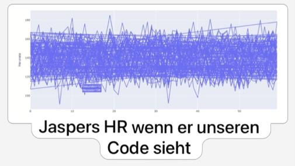

# Abschlussprojekt: HeartBeatAnalyzer
zur App gelangen (streamlit share): link

Diese App, ist eine Benutzeroberfläche zur Visualisierung und Analyse von Datensätzen wie EKG Aufzeichnungen und FIT-Files mehrerer Personen, die in einer JSON-Datenbank gespeichert sind. 
Der Benutzer der APP kann Person aus einer Liste auswählen, die aus der JSON-Datenbank geladen werden. Es werden dann grundlegende Informationen über die ausgewählte Person angezeigt, einschließlich ihres Profilbildes, falls eines vorhanden ist.
Falls mehrere Datensätze bei einer Person vorhanden sind, kann ausgewählt werden, welcher angezeigt werden soll.
Für .fit-Dateien werden Herzfrequenzdaten aus der FIT-Datei gelesen und visualisiert.
Für .txt-Dateien werden verschiedene Informationen zum EKG angezeigt: EKG-Dauer, Peaks und ein interaktiver Plot des EKG-Signals basierend auf dem ausgewählten Zeitbereich vom Benutzer.
Außerdem wird die Herzfrequenz angezeit und der Durchschnitt über die Zeit visualisiert. Herratenvariabilität 

Die Basis-Aufgaben wurden alle bearbeitet. Folge zusätzlichen Aufgaben wurden in die App implementiert:
- login feld 
- neue Person anlegen mit Profilbild  -> Drag and Drop
- neue Person anlegen mit Datensatz -> Drag and Drop
- Datensätze zu bereits erstellten Personen hinzufügen -> Drag and Drop
- Daten aus einer anderen Datenquelle einlesen (.fit-Datei) 
    -> den Personen dürfen nur entweder .txt oder .fit Datensätze zugewiesen werden, nicht beides. Ansonsten neue/zweite Person erstellen
- neue Datensätze mit Personen verknüpfen
- Herzrate in sinnvoll gleitenden Durchschnitt als Plot (rolling window)
- Herzratenvariabilität anzeigen
- Informationsseite mit Informationen über EKG und Herzrate 

Login Daten:

Nutzername: jasper.v

Passwort: LaufinZone5

